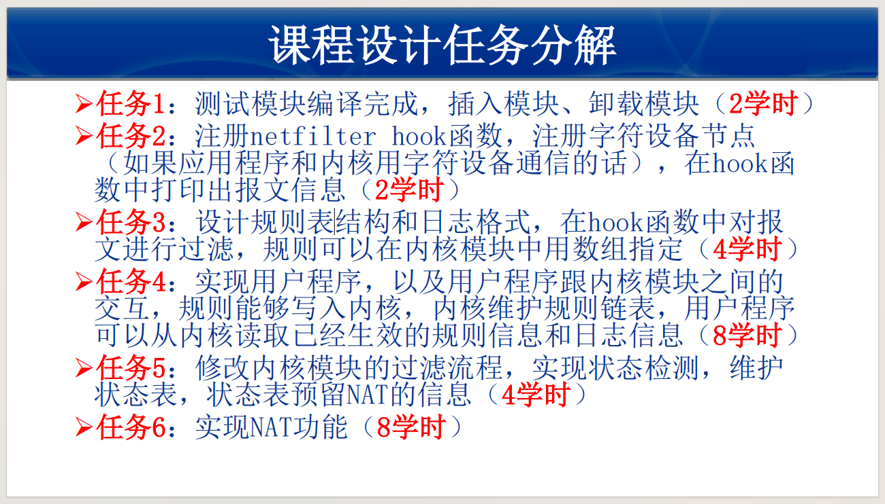
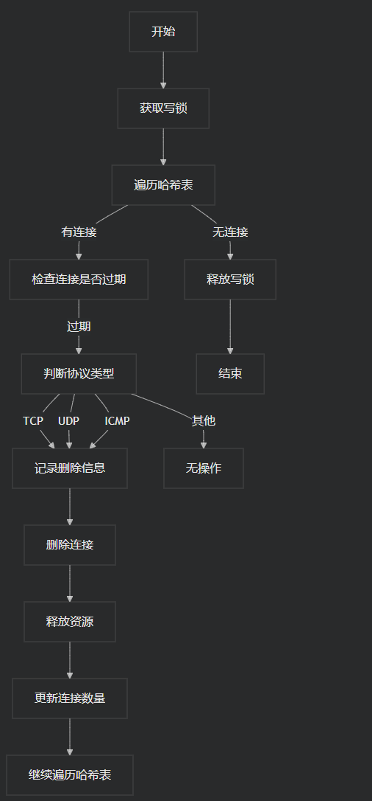
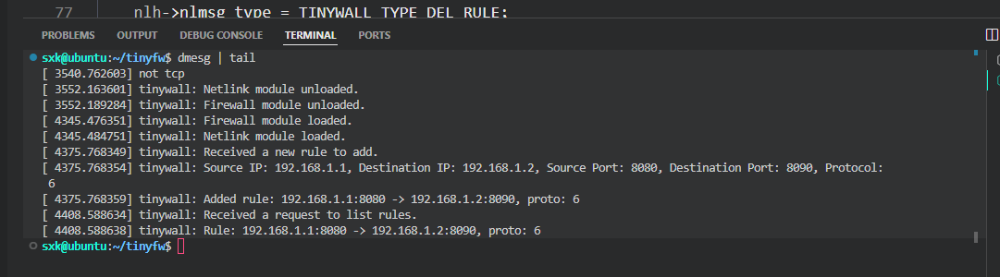

# netfilter模块设计

## 1. 项目规划

* 需求分析: 分析每个功能点，明确输入、输出和处理逻辑。

​	任务点如下:

* 模块设计: 将项目分解为多个模块，例如规则管理模块、连接管理模块、日志模块、NAT模块等。

  1. netfilter自定义模块设计

  2. netlink交互层

  3. 用户cmd/界面

     

## 2. 环境准备

开发环境: ubuntu20.04

版本控制: 使用Git等版本控制工具管理代码。

* 创建tinyfw项目开始同步

## 3. 基础功能实现

大概架构:


### 3.1 netfilter模块设计

该部分在tinywall.c中实现,主要实现了规则表(rule_table)和连接表(conn_table)

#### rule_table实现


#### conn_table实现

tinywall_conn结构如下:

```c
struct tinywall_conn
{
    __be32 saddr;
    __be32 daddr;
    __u8 protocol;
    union
    {
        struct
        {
            __u8 type;
            __u8 code;
        } icmp;
        struct
        {
            __be16 sport;
            __be16 dport;
            __u8 state;
        } tcp;
        struct
        {
            __be16 sport;
            __be16 dport;
        } udp;
    };
    __be64 timeout; // ktime_t
    struct hlist_node node;
};
```

tinywall_conn_table结构如下:

```c
struct tinywall_rule_table
{
    rwlock_t lock; // 读写锁
    __u32 rule_count;
    struct list_head *head; // 哈希链表头
};
```

对conn_table进行初始化:

```c
//init:
struct tinywall_conn_table *tinywall_conntable_init(void)
{
    int i = 0;
    conn_table = kmalloc(sizeof(struct tinywall_conn_table), GFP_KERNEL);
    if (!conn_table)
    {
        return ERR_PTR(-ENOMEM);
    }
    // INIT_LIST_HEAD(&conn_table->table);
    for (i = 0; i < HASH_SIZE; i++)
    {
        INIT_HLIST_HEAD(&conn_table->table[i]);
    }
    rwlock_init(&conn_table->lock);
    conn_table->conn_count = 0;
    return conn_table;
}
```

关于 `hlist_for_each_entry` 宏的详细解释

`hlist_for_each_entry` 宏的定义如下：

```c
c#define hlist_for_each_entry(tpos, pos, head, member)                 \
        for (pos = (head)->first;                                     \
             pos &&                                                    \
                ({ tpos = hlist_entry(pos, typeof(*tpos), member); 1; }); \
             pos = pos->next)
```

- `tpos` 是要访问的结构体类型的指针。
- `pos` 是当前遍历到的 `hlist_node` 类型的指针。
- `head` 是 `hlist_head` 类型的指针，指向链表头。
- `member` 是 `tpos` 结构体中的 `hlist_node` 成员的名称。

在这个宏中，`head` 必须是一个指向 `struct hlist_head` 的指针，因此需要使用 `&` 来获取 `table[hash]` 的地址。


#### 超时机制实现

清理conn_table表中的过期连接的程序流程图如下所示:



### 3.2 netlink模块设计

#### 内核态netlink.c设计

协商netlink协议号为:

```c
#define NETLINK_USER 31
```

初始化netlink套接字:

```c
struct sock *nl_sk = NULL;


// Netlink通信初始化
static int __init firewall_netlink_init(void)
{
    //定义配置,输入源
    struct netlink_kernel_cfg cfg = {
        .input = nl_recv_msg,
    };

    // initiate the netlink socket
    nl_sk = netlink_kernel_create(&init_net, NETLINK_USER, &cfg);
    if (!nl_sk)
    {
        printk(KERN_ALERT MODULE_NAME ": Error creating socket.\n");
        return -10;
    }

    printk(KERN_INFO MODULE_NAME ": Netlink module loaded.\n");
    return 0;
}
```

cfg中定义了处理输入使用的函数指针:nl_recv_msg,定义如下:

```c
static void nl_recv_msg(struct sk_buff *skb)
{
    struct nlmsghdr *nlh;
    struct firewall_rule_user *rule;

    nlh = nlmsg_hdr(skb);
    rule = (struct firewall_rule_user *)nlmsg_data(nlh);

    if (nlh->nlmsg_type == TINYWALL_TYPE_ADD_RULE)
    {
        ...
    }
    else if (nlh->nlmsg_type == TINYWALL_TYPE_DEL_RULE)
    {
        ...
    }
    else if (nlh->nlmsg_type == TINYWALL_TYPE_LIST_RULES)
    {
        ...
    }
    else
    {
        ...
    }
}
```

接受来自netlink socket发送过来的数据sk_buff skb,并进行相应操作.

#### 用户态netlink.c设计

构造socket,以及源地址与目标地址,以及netlink信息体nlh

```c
struct sockaddr_nl src_addr, dest_addr;
    struct nlmsghdr *nlh = NULL;
    int sock_fd;

    memset(&src_addr, 0, sizeof(src_addr));
    src_addr.nl_family = AF_NETLINK;
    src_addr.nl_pid = getpid();
    src_addr.nl_groups = 0;

    sock_fd = socket(AF_NETLINK, SOCK_RAW, NETLINK_USER);
    if (sock_fd < 0) {
        perror("socket");
        //printf("here!");
        exit(1);
    }

    bind(sock_fd, (struct sockaddr *)&src_addr, sizeof(src_addr));
```

根据输入构造rule之后,进行信息包装和发送:

```c
//...
//以上是构造rule内容
memcpy(NLMSG_DATA(nlh), &rule, sizeof(rule));

    struct iovec iov = { .iov_base = (void *)nlh, .iov_len = nlh->nlmsg_len };
    struct msghdr msg = { .msg_name = (void *)dest_addr, .msg_namelen = sizeof(*dest_addr), .msg_iov = &iov, .msg_iovlen = 1 };

    sendmsg(sock_fd, &msg, 0);
```

其中:

- **`NLMSG_DATA(nlh)`**：获取 `nlh` 指向的 Netlink 消息头之后的数据部分的指针。
- **`&rule`**：指向用户空间传递的 `rule` 结构体的指针。
- **`sizeof(rule)`**：`rule` 结构体的大小。

​	将用户空间传递的 `rule` 结构体的内容复制到 Netlink 消息的数据部分。具体步骤如下：

1. **获取数据部分的指针**：`NLMSG_DATA(nlh)` 返回一个指向 Netlink 消息数据部分的指针。
2. **复制数据**：`memcpy` 函数将 `rule` 结构体的内容复制到 Netlink 消息的数据部分。

`struct iovec` 结构体

`struct iovec` 是一个用于描述内存缓冲区的结构体，通常用于 `readv` 和 `writev` 系统调用，以及 Netlink 消息的发送和接收。它的定义如下：

```c
cstruct iovec {
    void  *iov_base;    // 缓冲区的起始地址
    size_t iov_len;     // 缓冲区的长度
};
```

在这段代码中：

```c
//tinywall_cmd.c
struct iovec iov = { .iov_base = (void *)nlh, .iov_len = nlh->nlmsg_len };
```

- `iov_base` 被设置为 `nlh`，即 Netlink 消息头的指针。
- `iov_len` 被设置为 `nlh->nlmsg_len`，即 Netlink 消息的总长度。

`struct msghdr` 结构体

`struct msghdr` 是一个用于描述消息的结构体，通常用于 `sendmsg` 和 `recvmsg` 系统调用。它的定义如下：

```c
struct msghdr {
    void         *msg_name;       // 指向地址结构的指针
    socklen_t     msg_namelen;    // 地址结构的长度
    struct iovec *msg_iov;        // 指向 iovec 数组的指针
    size_t        msg_iovlen;     // iovec 数组的元素个数
    void         *msg_control;    // 辅助数据（如控制消息）
    size_t        msg_controllen; // 辅助数据的长度
    int           msg_flags;      // 标志（如 MSG_OOB）
};
```

在这段代码中：

```c
struct msghdr msg = { .msg_name = (void *)dest_addr, .msg_namelen = sizeof(*dest_addr), .msg_iov = &iov, .msg_iovlen = 1 };
```

- `msg_name` 被设置为 `dest_addr`，即目标地址的指针。`dest_addr` 通常是一个 `struct sockaddr_nl` 结构体，用于指定 Netlink 套接字的地址。
- `msg_namelen` 被设置为 `sizeof(*dest_addr)`，即目标地址结构体的大小。
- `msg_iov` 被设置为 `&iov`，即指向 `iovec` 结构体的指针。
- `msg_iovlen` 被设置为 `1`，表示 `iovec` 数组中只有一个元素。

#### 综合解释

这两行代码的作用是构造一个 `struct msghdr` 结构体，用于通过 Netlink 套接字发送消息。具体来说：

1. **`struct iovec`**：描述了要发送的 Netlink 消息的缓冲区，包括消息头和消息数据。
2. **`struct msghdr`**：描述了整个消息，包括目标地址、缓冲区数组及其长度。

​	信息流通过程大致是:

* **用户空间调用 `sendmsg`**：

```c
int sendmsg(int sockfd, const struct msghdr *msg, int flags);
```

* **系统调用进入内核**：
  - 内核中的 `sys_sendmsg` 函数处理 `sendmsg` 系统调用。

  - `sys_sendmsg` 调用 `sock_sendmsg`，最终调用到具体的协议处理函数。
* **Netlink 协议处理**：

  - 对于 Netlink，最终调用 `netlink_sendmsg` 函数。

  - `netlink_sendmsg` 函数负责将 `struct msghdr` 转换为 `struct sk_buff`。
  - 然后sk_buff被传入自定义的处理input的函数指针指向的函数中(上文中的nl_recv_msg()).


#### 接收内核态发送的规则信息并写入rules_table.txt文件

详见tinywall_cmd.c中rules_store函数

Netlink 套接字本身支持流水线操作，这意味着可以连续发送和接收多个消息，而不需要等待每个消息的响应。然而，具体的行为取决于的实现方式。以下是一些关键点，帮助理解 Netlink 套接字的流水线特性：

流水线操作的特点

1. **发送消息**：

   - 可以连续发送多个消息，而不需要等待每个消息的响应。这可以通过多次调用 `sendmsg` 实现。

   - 例如，可以在一个循环中发送多个规则：

     ```
     for (int i = 0; i < num_rules; i++) {
         send_rule_to_kernel(&rules[i]);
     }
     ```

2. **接收消息**：

   - 可以在一个循环中接收多个消息，直到所有消息都被处理完。
   - `recvmsg` 函数可以一次接收多个 Netlink 消息，这些消息被封装在一个缓冲区中。
   - 可以使用 `NLMSG_OK` 和 `NLMSG_NEXT` 宏来遍历接收到的消息。

##### 代码中的流水线操作

在的代码中，已经实现了接收多个消息的流水线操作。具体来说：

1. **外层 `while (1)` 循环**：
   - 这个循环不断调用 `recvmsg` 来接收新的消息。
   - 如果 `recvmsg` 返回值小于 0，表示接收失败，跳出循环。
2. **内层 `while (NLMSG_OK(nlh, ret))` 循环**：
   - 这个循环遍历接收到的每个 Netlink 消息。
   - 使用 `NLMSG_OK` 宏检查当前消息头是否有效。
   - 使用 `NLMSG_NEXT` 宏移动到下一个消息头。

### 3.3 规则表,状态表,日志的设计

数据结构: 使用内核链表或哈希表存储规则。

用户接口: 使用 procfs 或 sysfs 提供用户接口，允许添加、删除、修改和查看规则。

持久化: 实现规则的持久化存储和加载功能。


### 3.4 使用到的相关数据结构

1. 在 Linux 内核中，struct sk_buff（通常简称为 skb）是一个非常重要的数据结构，用于表示网络数据包（socket buffer）。它是 Linux 网络子系统中的核心组件之一，负责管理网络数据的接收和发送。

   ​	struct sk_buff 的主要功能

   * 数据存储：

     sk_buff 结构体用于存储网络数据包的原始数据。它可以包含来自网络接口的接收数据，也可以用于发送数据。

   * 元数据管理：

     除了存储数据，sk_buff 还包含与数据包相关的元数据，例如数据包的长度、协议类型、源和目的地址、网络层和传输层头部信息等。

   * 链表结构：

     sk_buff 结构体通常以链表的形式组织，以便在处理多个数据包时能够高效地进行管理。

   * 状态信息：

     ```c
     sk_buff 还包含一些状态信息，例如数据包的状态、优先级、时间戳等。
     
     struct sk_buff 的定义
     
     struct sk_buff 的定义通常在 include/linux/skbuff.h 中。以下是一个简化的示例，展示了 sk_buff 结构体的一部分：
     
     struct sk_buff {
     
       struct sk_buff *next;   *// 指向下一个 sk_buff*
     
       struct sk_buff *prev;   *// 指向上一个 sk_buff*
     
       unsigned char *data;    *// 数据指针*
     
       unsigned int len;     *// 数据长度*
     
       *// 其他元数据字段*
     
       struct net_device *dev;  *// 关联的网络设备*
     
       *// 其他字段...*
     
     };
     ```

     

     使用场景

     接收数据包：当网络接口接收到数据包时，内核会创建一个 sk_buff 实例来存储该数据包，并将其传递给网络协议栈进行处理。

     发送数据包：在发送数据包时，内核会构建一个 sk_buff 实例，填充数据和元数据，然后将其传递到网络接口进行发送。

     总结

     struct sk_buff 是 Linux 内核中用于表示网络数据包的核心数据结构。它不仅存储数据包的原始数据，还管理与数据包相关的元数据和状态信息。通过使用 sk_buff，内核能够高效地处理网络数据的接收和发送。

   

   

2. 在 Linux 内核中，timer_list 是一个用于管理定时器的结构体类型。它定义在 <linux/timer.h> 头文件中，主要用于实现内核中的定时器功能。

   **timer_list 结构体**

   ```c
   timer_list 结构体的定义通常如下所示（具体实现可能会有所不同）：
   
   struct timer_list {
   
     struct hlist_node entry; *// 用于链表管理的节点*
   
     unsigned long expires;   *// 定时器到期的时间（以 jiffies 为单位）*
   
     void (*function)(struct timer_list *); *// 定时器到期时调用的回调函数*
   
     *// 其他字段...*
   
   };
   ```

   **主要字段**

   ​	entry：用于将定时器链接到定时器链表中的节点。

   ​	expires：定时器到期的时间，通常以 jiffies（内核中用于表示时间的单位）为单位。

   ​	function：当定时器到期时调用的回调函数。在您的代码中，tinywall_timer_callback 是这个回调函数。

   **使用定时器**

   ​	在您的代码中，您使用了 timer_setup 函数来初始化定时器，并设置定时器的回调函数：

   ​	

   ```c
   timer_setup(&conn_timer, tinywall_timer_callback, 0);
   ```

   ​	然后，您设置定时器的到期时间，并添加定时器：

   ```c
   	conn_timer.expires = jiffies + HZ * 10; *// 设置定时器在 10 秒后到期*
   
   ​	add_timer(&conn_timer); *// 添加定时器*
   
   
   ```

​	**定时器回调函数**

​	当定时器到期时，内核会调用您指定的回调函数 tinywall_timer_callback。在这个函数中，您可以执行需要在定时器到期时进行的操作，例如清理连接表。

​	**总结**

​	timer_list 是 Linux 内核中用于管理定时器的结构体类型。它包含了定时器的到期时间和回调函数等信息。通过使用 timer_list，您可以在内核模块中实现定时器功能，以便在特定时间执行某些操作。

## 4. 高级功能实现

### 4.1 默认动作

默认策略: 设置未匹配规则的默认动作（如丢弃或接受）。

### 4.2 连接管理

连接表: 使用哈希表实现连接跟踪，记录允许的连接。

超时管理: 实现连接超时机制，定期清理过期连接。

状态查看: 提供接口查看当前连接表信息。

### 4.3 状态检测

状态机设计: 为TCP、UDP、ICMP设计状态机，记录和检查通信状态。

状态变迁: 在连接表匹配时更新状态。

## 5. 日志和审计

日志记录: 使用 printk 或 tracepoints 记录访问日志和管理日志。

日志查询: 提供接口查询日志，支持条件过滤。

## 6. NAT转换

NAT策略: 设计和实现NAT策略，支持源NAT和目的NAT。

NAT处理: 在Netfilter钩子中实现NAT转换逻辑。

## 7. 测试和优化

### 7.1. 测试遇到的问题

1. 编译遇到的问题,内核头文件不能被用户程序文件使用,试图使用两个头文件解决

   * 解决方法:使用firewall_rule和firewall_rule_user两种相似的结构

2. 严重的崩溃问题,模块一装载就死机...还不清楚问题

   * 解决了,rule_list没有初始化,以及其中的rwlock没有初始化,还有几个操作的读写锁使用不当的问题

3. 用户进程与内核空间的netlink不能通信问题

   * 解决了不能通信的问题,netlink协议号没有设置

     

     

4. 编译问题:

   ```shell
   /home/sxk/tinyfw/tinywall.c: In function ‘tinywall_rule_remove’: /home/sxk/tinyfw/tinywall.c:67:26: error: incompatible type for argument 1 of ‘_raw_write_lock’ 67 | write_lock(rule_table->lock); | ~~~~~~~~~~^~~~~~ | | | rwlock_t {aka struct <anonymous>} 
   ```

   因为 `write_lock` 函数期望一个 `rwlock_t *` 类型的参数，而传递了一个 `rwlock_t` 类型的参数。具体来说，`rule_table->lock` 是一个 `rwlock_t` 类型的变量，而不是一个指针。

   解决方法

   需要传递 `rule_table->lock` 的地址，即使用 `&` 操作符。

5. 模块存在空指针解引用问题,导致了模块装载后无法卸载.正在排查

   ​	解决方法:不用指针表示,直接用类型本体

6. 另一个红温问题:user_cmd总是会被kill,不知道为什么.

7. 